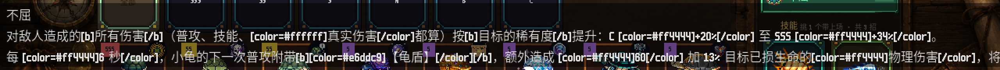
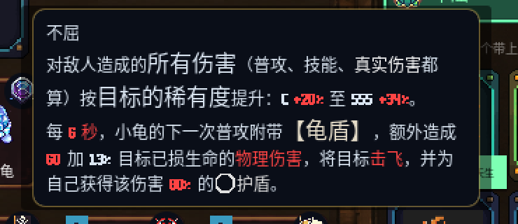
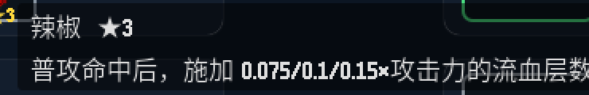
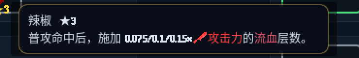
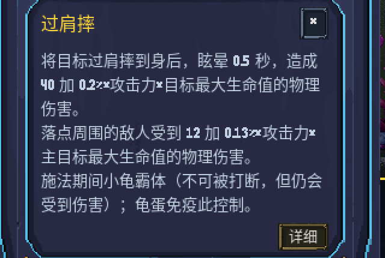
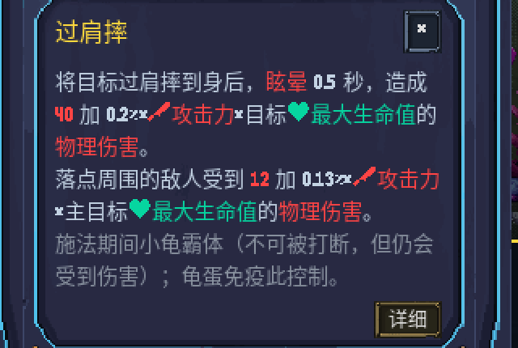
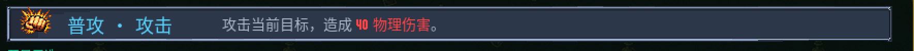

# 文案落点 BBCode 普查

状态：已完成

> 2026-10-01 把技能/装备文案做成了带颜色、带内联属性图标（`[img]`）、带加粗的 BBCode。
> 一段 BBCode 落到 `Label` 上，Godot 会把标记**原样印给玩家**。
> 本文逐个落点查清：谁吃 BBCode、谁不吃、不吃的那几个屏幕上到底长什么样，并把能修的修掉。
>
> 本文是一次调查 + 修复的记录，不是任何东西的事实源。数值/行为以 `scripts/` 为准。

---

## 0. 结论先行

| | |
|---|---|
| 显示技能/装备文案的落点 | **21 个** |
| 其中**控件不吃 BBCode**（`Label` / 系统 tooltip） | **3 个** |
| 其中**控件吃、但喂进去的是纯文本**（上色链在这里断掉） | **3 个** |
| 真正在屏幕上**原样印标记**（玩家可见的乱码） | **1 个** —— 选龟页被动 chip 的 tooltip |
| 本轮改了 | **4 个落点 + 1 个共享宿主放宽基类 + 2 条判据** |
| 没改 | **0 个**（没有"换不了"的） |

---

## 1. 需求原文

本轮任务（逐字）：

> 查清并修好：战斗内那个 44×44 的文案落点到底吃不吃 BBCode。
> 这件事压着整条文案上色链 —— 今天刚把技能/装备文案做成了带颜色、带内联属性图标（`[img]`）、
> 带加粗的 BBCode，但如果某个落点用的是 `Label` 而不是 `RichTextLabel`，那里就会把 BBCode
> 原样当纯文本显示出来（玩家看到 `[color=#ff4444]攻击力[/color]` 这种），或者图标直接不显示。

要产出：①全仓有几个地方显示技能/装备文案（场景/控件类型/文本来源，给 file:line）
②哪些吃、哪些不吃 ③不吃的现在屏幕上**实际**显示成什么样（**要实拍**）。
修：能换 `RichTextLabel` + `bbcode_enabled` 的就换，换不了的如实写清为什么，不要硬改。
每改一处配一条判据，判据要量产品自己的账、反向验证会红。

给的线索（任务里写明"不要当结论，自己验"）：

> `scripts/scenes/rich_tooltip.gd` 存在，但只被背包用；战斗那个落点没挂它。
> 渲染入口是 `SkillText.render_bbcode()`（`scripts/util/skill_text.gd`）。

两条线索**都核实为真**，见 §2 与 §3。

---

## 2. 调查

### 2.1 渲染入口产出什么

`scripts/util/skill_text.gd`：

| 函数 | 产出 |
|---|---|
| `render_bbcode(tpl, f, s, font_px)` :511 | **BBCode**（`[color]` / `[b]` / `[img]`） |
| `equip_brief_bb` :578 / `equip_full_bb` :582 / `plain_to_bb` :588 | **BBCode** |
| `glossary_bb` :603 / `highlight_star` :728 / `star_legend_bbcode` :719 | **BBCode** |
| `render_html` :328 | HTML（中间态，不进 UI） |
| `render_plain` :679 / `equip_brief` :526 / `equip_full` :542 / `render_consts` :856 | 纯文本 |

### 2.2 技能 / 被动文案落点

| # | 场景 | 文件:行 | 控件 | 文本来源 | 吃 BBCode？ |
|---|---|---|---|---|---|
| 1 | 图鉴·被动条简述 | `scripts/scenes/codex/detail_views.gd:297` | `RichTextLabel` | `render_bbcode` | ✅ |
| 2 | 图鉴·被动展开全文 | `scripts/scenes/codex/detail_views.gd:794` | `RichTextLabel` | `render_bbcode` | ✅ |
| 3 | 图鉴·技能卡简述（3 选 1） | `scripts/scenes/codex/detail_views.gd:552`／`575` | `RichTextLabel` | `render_bbcode` | ✅ |
| 4 | 图鉴·技能展开全文 | `scripts/scenes/codex/detail_views.gd:768` | `RichTextLabel` | `render_bbcode` | ✅ |
| 5 | **图鉴·普攻条简述** | `scripts/scenes/codex/detail_views.gd:455`（改前） | **`Label`**（`CodexScene._add_text:776`） | `render_plain` | ❌ **已改** |
| 6 | 图鉴·小将技能/被动 | `detail_views.gd:49` → `_minion_body:60` | `RichTextLabel` | `MinionCodex` 静态文案（无标记） | ✅（无标记可印） |
| 7 | 选龟·技能图标 tooltip | `scripts/scenes/team_select/skill_picker.gd:82` → `_skill_tooltip:269` | `SkillTipButton._make_custom_tooltip` → `RichTextLabel` | `render_bbcode` | ✅ |
| 8 | 选龟·技能点开弹窗 | `skill_picker.gd:207` → `TeamSelectScene._show_detail_popup:600` | `RichTextLabel` | `render_bbcode` | ✅ |
| 9 | **选龟·被动 chip tooltip** | `scripts/scenes/team_select/detail_panel.gd:194`（改前） | **系统 tooltip = `Label`**（`chip` 是裸 `PanelContainer`） | `render_bbcode` | ❌ **原样漏给玩家·已改** |
| 10 | 选龟·被动点开弹窗 | `detail_panel.gd:202` → `_show_detail_popup` | `RichTextLabel` | 同上 | ✅ |
| 11 | **战斗·信息面板技能描述浮层** | 控件 `scripts/scenes/battle/info_panel.gd:1608`／文本 `battle_render.gd:664` | `RichTextLabel`（`bbcode_enabled`） | `render_plain` + `_strip_html` ⇒ **纯文本** | ⚠ 控件吃、料是白的·**已改** |

### 2.3 装备 / 羁绊文案落点

| # | 场景 | 文件:行 | 控件 | 文本来源 | 吃 BBCode？ |
|---|---|---|---|---|---|
| 12 | 图鉴·装备效果 | `detail_views.gd:916` | `RichTextLabel` | `equip_brief_bb` + `equip_full_bb` | ✅ |
| 13 | 图鉴·消耗品效果 | `detail_views.gd:999` | `RichTextLabel` | `render_bbcode` | ✅ |
| 14 | 图鉴·羁绊逐档 | `detail_views.gd:1062` | `RichTextLabel` | `render_consts` + 手拼 BBCode | ✅ |
| 15 | 图鉴·状态 / 规则说明 | `detail_views.gd:1145`／`1171` | `RichTextLabel` | json `desc`（无标记） | ✅（无标记可印） |
| 16 | 背包·操作栏正文 | `scripts/scenes/InventoryScene.gd:977` | `RichTextLabel` | `equip_brief_bb` | ✅ |
| 17 | 背包·【细看】弹框 | `InventoryScene.gd:1118` | `RichTextLabel` | `equip_full_bb` + `highlight_star` | ✅ |
| 18 | **背包·格子 tooltip** | `InventoryScene.gd:1304`（改前的料在 `:1306`） | `rich_tooltip.gd` → `RichTextLabel` | `equip_brief`（**纯文本**） | ⚠ 宿主吃、料是白的·**已改** |
| 19 | 背包·羁绊弹框 | `scripts/scenes/inventory/synergy_panel.gd:342` | `RichTextLabel` | `render_consts` + 手拼 BBCode | ✅ |
| 20 | 商店·装备详情说明 | `scripts/scenes/ShopScene.gd:1284` + `_rich_desc:1519` | `RichTextLabel` | `equip_full_bb` + `highlight_star` | ✅ |
| 21 | 战斗·信息面板装备详情浮层 | `scripts/scenes/battle/info_panel.gd:901` → `_show_detail` | `RichTextLabel` | `equip_brief_bb` | ✅ |
| 22 | **战斗·对阵预览 44×44 装备格 tooltip** | `scripts/scenes/battle/dual_lane_flow.gd:324`（改前） | **系统 tooltip = `Label`**（`box` 是裸 `Panel`） | `equip_brief`（纯文本） | ❌ **已改** |

> 清单按「一个可见文案区」计数（21 个），表里 22 行是因为 #3 占一行两处。
> 同一函数里的标题/副标题不单列。

### 2.4 查过、确认不是文案落点

- `battle_hud.gd:465`（`_mk_icon_btn` 的 tip）／`:2192`（头像框「点开细看」）／`:2717`（羁绊档位）——固定短句。
- `ShopScene.gd:763`、`InventoryScene.gd:290/494/599/603/645/1371/1448`、`synergy_panel.gd:241`、
  `top_bar.gd` 系列、`BracketMapScene.gd:1081` —— 同上，纯提示语。
- `battle/review_console.gd`、`battle_debug_arena.gd` —— dev 工具面板，不进玩家视野。

### 2.5 Godot 的系统 tooltip 到底是什么（实测，不是查文档）

一个控件**没覆写** `_make_custom_tooltip` 时，连这个方法都**不存在** ——
实测报 `Invalid call. Nonexistent function '_make_custom_tooltip' in base 'PanelContainer'`。
Godot 这时给它造的宿主在 4.6 里是 `PopupPanel` + 一个纯 **`Label`**
（旧版叫 `TooltipPanel`/`TooltipLabel`，**类名里已经没有 "Tooltip" 字样了**）。

---

## 3. 出入（预期 ↔ 代码事实）

| 以为的 | 实际的 |
|---|---|
| 「战斗那个落点没挂 `rich_tooltip`」 | **成立**。而且挂不上 —— `rich_tooltip.gd` 原来 `extends Panel`，`set_script` 要求脚本基类是节点类的**祖先**，而 `Panel` 与 `PanelContainer` 是**兄弟**。选龟页那个 chip 就是 `PanelContainer`。 |
| 「不吃 BBCode 的落点会把标记印出来」 | **只对 1 个成立**（选龟被动 chip）。另外 2 个不吃的落点喂的本来就是纯文本，所以不漏标记 —— 它们的毛病是**看不到 2026-10-01 新上的颜色和图标**。 |
| 「吃 BBCode 的落点就没问题」 | **不成立**。有 3 个落点控件是 `RichTextLabel` + `bbcode_enabled`，却一直被喂纯文本；其中 `battle_render._render_skill_text` 更是**主动把标记扒掉**（`render_plain` + `_strip_html`）。 |
| 「实拍 tooltip 就是开窗口截图」 | 要先让它浮出来。`Input.parse_input_event()` **喂不动 GUI 的 hover**，得用 `Viewport.push_input()`，而且要**先在控件外面动一下再移进来**（一次就位不换 `mouse_over`）。 |

---

## 4. 方案（改了什么）

| # | 文件 | 改动 | 为什么 |
|---|---|---|---|
| A | `scripts/scenes/rich_tooltip.gd:1` | `extends Panel` → **`extends Control`** | 见 §3 第一行。放宽到 `Control` 后任何控件都能挂，不用抄第二份宿主。脚本只覆写 `_make_custom_tooltip`、不碰 `Panel` 独有 API；`set_script` 也不改节点的原生类，所以原来挂着它的 `Panel` 行为一个字没变。 |
| B | `scripts/scenes/team_select/detail_panel.gd:9,201` | 加 `const RichTooltip` + `chip.set_script(RichTooltip)` | §5.1 那段乱码。 |
| C | `scripts/scenes/battle/dual_lane_flow.gd:7,325-333` | 加 `const RichTooltip` + `box.set_script(RichTooltip)`；`equip_brief` → `equip_brief_bb(edef, 13)` | §5.2。字号 13 对齐 `rich_tooltip` 正文的 12px，内联图标缩到 15px。 |
| D | `scripts/scenes/InventoryScene.gd:1310` | `equip_brief` → `equip_brief_bb(edef, 13)` | 宿主本来就是 `RichTextLabel`，却一直喂纯文本 ⇒ 同一屏上操作栏彩色、格子 tooltip 白字。 |
| E | `scripts/scenes/battle/battle_render.gd:6-9,669-688` | `_render_skill_text`：`render_plain` + `_strip_html` → `render_bbcode(..., SKILL_TEXT_FS)`；新增 `const SKILL_TEXT_FS := 13` | §5.3。原实现把渲染管线刚上好的颜色/图标**原场扒掉**。不再调 `_strip_html`：`render_bbcode` 内部已把 HTML 转 BBCode 并解过实体，而 `<[^>]*>` 那条正则对 BBCode 本来就不生效。 |
| F | `scripts/scenes/codex/detail_views.gd:455-473` | 普攻简述 `Label`(`_add_text`) → `RichTextLabel` + `render_bbcode` | §5.4。版式照同文件上面被动条那一份（定高一行 + `clip_contents`，`fit_content=false`）。条高只有 36px，`fit_content=true` 会把三选一卡片挤下去。 |

### 没改的、以及为什么

- **没有「换不了」的落点**。清单里其余 15 条本来就是 `RichTextLabel` + `bbcode_enabled`
  且喂的是 BBCode（或喂的是本来就没有标记的静态文案），不需要动。
- `MinionCodex` 的小将技能文案（#6）、图鉴状态/规则 `desc`（#15）**没有接上色管线** ——
  它们走的是另一份静态表、不是 `pets.json` 的技能模板。控件是吃 BBCode 的，
  哪天要给它们上色只用换文本来源、不用动控件。**不在本轮范围内，登记在这。**
- `rich_tooltip` 的正文字号写死 12px、宽 300px。被动那段文案比较长，在小屏上会偏高。
  **本轮没动**：三个落点共用这一份样式，动它是另一件事。

---

## 5. 实拍证据

一律 `bash godot-quiet.sh`（强制静音）＋ `--position 5000,5000`（窗口丢屏外）＋
**不加 `--headless`**（无头不渲染，截出来是空图而且不报错）。

工具（`_` 前缀 ⇒ `run-tests.sh` 不收录）：
`tests/_post_ts_tooltip.gd`（配 `tests/_shot_scene.gd` 的 `SHOT_POST`）、
`tests/_shot_dl_tooltip.gd`（战斗对阵预览幕布）。

> 拍 tooltip 栽过一次值得记：第一版按类名找 `*Tooltip*` 节点 ⇒ 报「没浮出来」。
> **实际早就浮出来了**，只是 Godot 4.6 的宿主类名是 `PopupPanel`。
> 典型的「判据没错但找错了对象」—— 差点把"我拍不到"写成"这块不存在"。

### 5.1 选龟页·被动 chip tooltip —— 改前就是玩家能看到的乱码



探针同时打出了【屏幕上真正画出来的字】（`Label.text`，没有第二层解释）：

```
[TIP] 命中 PanelContainer  脚本=无
[TIP] ★没有 _make_custom_tooltip 这个方法 ⇒ 走系统 tooltip(纯 Label)
[TIP] tooltip 宿主 = PopupPanel  visible=true
[TIP] ★里面是 Label(不吃 BBCode) · 屏幕上原样印出来的字 =
      |不屈⏎对敌人造成的[b]所有伤害[/b]（普攻、技能、[color=#ffffff]真实伤害[/color]都算）按
       [b]目标的稀有度[/b]提升：C [color=#ff4444]+20%[/color] 至 SSS [color=#ff4444]+34%[/color]。…|
```

改后：



```
[TIP] 命中 PanelContainer  脚本=res://scripts/scenes/rich_tooltip.gd
[TIP] ★里面是 RichTextLabel(吃 BBCode) · 解析后文字 =
      |不屈⏎对敌人造成的所有伤害（普攻、技能、真实伤害都算）按目标的稀有度提升：C +20% 至 SSS +34%。…|
```

### 5.2 战斗·对阵预览 44×44 装备格 tooltip（本次点名的那个落点）

改前（纯 `Label`：没颜色、没内联属性图标）：



改后（`RichTextLabel`：攻击力红字 + 剑形属性图标、流血粉字）：



```
改前: [DLTIP] 命中 Panel 脚本=无
      ★tooltip 里是 Label(不吃 BBCode) · 屏上原样印的字 = |辣椒 ★3⏎普攻命中后，施加 0.075/0.1/0.15×攻击力的流血层数。|
改后: [DLTIP] 命中 Panel 脚本=res://scripts/scenes/rich_tooltip.gd
      ★tooltip 里是 RichTextLabel(吃 BBCode) · 屏上的字 = |辣椒 ★3⏎普攻命中后，施加 0.075/0.1/0.15× 攻击力的流血层数。|
      （tooltip_text 原文里有 [img width=15 color=#ff4444]…atk-icon.png[/img][color=#ff4444]攻击力[/color]）
```

> ⚠ **这一条改前并不漏标记** —— 它喂的本来就是纯文本 `equip_brief`。
> 它的毛病是「全场唯一一处看不到 2026-10-01 新上的颜色和图标」：
> 同一件装备在背包/商店/图鉴是彩色带图标的，一进战斗就变白字。

### 5.3 战斗·信息面板技能描述（控件早就吃 BBCode，一直没人喂它）

`tests/_shot_info_panel.tscn`，`SHOT_PET=basic SHOT_DETAIL=skill SHOT_EQ=1`：





### 5.4 图鉴·普攻条简述

改后（"40" 与 "物理伤害" 上色，与旁边三张 3 选 1 卡同一长相）：



---

## 6. 已知风险与未决点

- **`rich_tooltip.gd` 基类放宽**影响所有挂它的控件（现在 3 处）。它只覆写一个方法、
  不碰 `Panel` 的 API，`set_script` 也不改节点的原生类 —— 但这是一处**共享原语**的改动，
  合并时值得多看一眼。
- **战斗技能描述改成 BBCode** 之后，`tests/verify_info_panel.gd` 那条
  「屏上印的就是取数函数现算的那段」原本是拿 `RichTextLabel.get_parsed_text()`（去了标记）
  比 `_skill_body_text()` 的返回值（现在带标记）。该测试**自己的注释就预告过这一天**
  （"哪天描述改成带 BBCode 的，这条会红在'字不一样'上，那时要改的是比法，不是把这条删掉"）。
  已按它说的改了比法：**两边都过同一个 `RichTextLabel` 解析器再比**，判据的意思一个字没改。
- 对阵预览幕布的截图是直接调 `_dl_build_present_overlay("preview")` 建出来的 ——
  节点/版式/tooltip 全是产品同一份代码，但**没有走完整的流程状态机**。
  要拍"真打一局走到那一步"得另配 `DUALLANE=1` 的长流程。
- `verify_elite_anim` 的金样本比对**对行尾瞎**（见 §8 第 3 条）。本轮顺手修了那一条，
  但 `tests/golden/` 下另外两份（`dead_params_debt.txt` / `determinism_cross.json`）
  **没逐一复查**是不是同一个形状。⏳待后续单独查。
  ⇒ **2026-10-04 查完**：两份**都不是**同一个形状 —— `dead_params_debt.txt` 每行先过 `strip_edges()`（CR 被扒掉），
  `determinism_cross.json` 走 JSON 解析（空白不敏感）；新 worktree（CRLF）实跑两条门禁都绿。
  但「现在不瞎」只是实现碰巧对，没人守着 ⇒ 两条门禁各加一条**显式**判据：同一份文本强制造出 LF 版与 CRLF 版，
  过门禁真用的那个解析口，必须逐条相同、条目/键值里 0 个 CR（`verify_dead_params` / `verify_determinism_cross`）。
  反向验证：把台账解析里的 `strip_edges()` 换成只去空格 ⇒ 新判据红（「18 个 CR」）；逐字节还原。

---

## 7. 验收

**两件只能人工验的事**（没有门禁能证明，所以**不列进下面的勾**，免得拿"打了勾"冒充"有人守"）：

- **全仓文案落点清单齐不齐** —— §2.2 / §2.3。查全性靠的是把 `tooltip_text` /
  `.text =` / `SkillText.*` 三条线各扫一遍全仓再逐个读代码，不是一条断言。
- **不吃 BBCode 的那几个屏幕上实际长什么样** —— §5.1 / §5.2 的实拍，人眼判。
  工具留在 `tests/_post_ts_tooltip.gd` / `tests/_shot_dl_tooltip.gd`，可重跑复核。

下面每一条都点名了证明它的那条门禁：

- [x] 每个带 BBCode 的 tooltip 都有能渲染它的宿主；屏上没有任何 `Label` 在原样印标记
      —— `tests/verify_text_bbcode_hosts.gd` ①（选龟页整屏 456 个 Control 遍历）
- [x] 战斗内 44×44 装备格的 tooltip 吃 BBCode —— `tests/verify_text_bbcode_hosts.gd` ②
- [x] 背包格子 tooltip 喂的是 `_bb` 版（里面有内联属性图标）—— `tests/verify_text_bbcode_hosts.gd` ③
- [x] 战斗信息面板的技能描述带颜色与内联图标，且屏上无残留标记
      —— `tests/verify_text_bbcode_hosts.gd` ④
- [x] 判据量的是产品自己的账（真调 `_make_custom_tooltip`、真读 `get_parsed_text()`），
      且四处改坏各自红 —— `tests/verify_text_bbcode_hosts.gd`（含断言条数对账，防静默跳过）
- [x] 全套门禁绿 —— `run-tests.sh`

---

## 8. 决策记录

1. **不另写第二份 tooltip 宿主，而是把 `rich_tooltip.gd` 的基类放宽。**
   本仓已经有两份 BBCode tooltip 宿主（`rich_tooltip.gd` 给 Panel、`SkillTipButton.gd` 给 Button）。
   再加第三份就是"手抄的副本必然落后"。放宽基类是成本最低且不新增分叉的做法。
2. **不给 `rich_tooltip` 加"首行当标题"的拆分。** 背包那一处的首行是
   `[b]名字[/b]  ★2  3费` —— 本身就是 BBCode。拆成纯 `Label` 标题会**制造一个新的泄漏点**。
   同理，选龟被动 tooltip 的首行**保持纯文字**，不加 `[b]`：它还会被
   `_show_detail_popup_from` 切成标题塞进一个 `Label`（`TeamSelectScene.gd:592-597`）。
3. **`verify_elite_anim` 的 CRLF 误报按"修判据"处理，不是放宽。**
   金样本是 Godot 写的（LF 行尾），而本仓 `core.autocrlf=true` ⇒ 任何新 clone / 新 worktree
   检出来都是 CRLF ⇒ 按换行切出来的每一行末尾都多一个 CR ⇒ 全部 23 行被报成「素材变了」。
   实测：新 worktree 必红、主仓绿（主仓那份是测试自己写出来的 LF）。
   CR 不属于任何一行的含义，扒掉它之前必红、之后照样红 —— **判据一个字没放宽**。

---

## 9. 实施回填

全部改动已落在 worktree（**未提交**，按要求交给主会话审与合）。

**产品侧 6 个文件**：`rich_tooltip.gd`、`team_select/detail_panel.gd`、
`battle/dual_lane_flow.gd`、`InventoryScene.gd`、`battle/battle_render.gd`、
`codex/detail_views.gd` —— 逐条对应 §4 的 A~F。

**判据侧**：
- 新增 `tests/verify_text_bbcode_hosts.gd` / `.tscn`（自动发现，已进门禁），17 条断言。
  量的是产品自己的账：
  - tooltip 侧 —— 真调控件自己的 `_make_custom_tooltip()`，看它吐出来的宿主里有没有
    `bbcode_enabled` 的 `RichTextLabel`，并且那个 `RichTextLabel` 的 `get_parsed_text()`
    （= 屏幕上真正的字）里**不许再剩标记**。
  - 常驻文字侧 —— 把选龟页整屏（实测 456 个 `Control`）遍历一遍，
    任何 `Label.text` 里出现 BBCode 标记就红。
  - 分母 —— 打印「扫了几个控件 / 其中几个 tooltip 带 BBCode」，并在末尾对账
    「这一轮真的跑了几条断言」（一条 `SCRIPT ERROR` 就能把半个测试静默跳过而照样 `ALL PASS`）。
- 改 `tests/verify_info_panel.gd`：新增 `_parsed_text()` 助手，把「现算那段」也过一遍
  同一个 BBCode 解析器再比（见 §6 第 2 条）。
- 改 `tests/verify_elite_anim.gd`：金样本比对扒掉行尾 CR（见 §8 第 3 条）。

**反向验证（四处一起改坏 ⇒ `FAILED: 5`，断言条数仍是 17，没有被静默跳过）**：

| 把什么改坏 | 红在哪条 |
|---|---|
| 去掉 `detail_panel.gd` 的 `chip.set_script(RichTooltip)` | ① `["PanelContainer: 没有 _make_custom_tooltip ⇒ 系统纯 Label tooltip"]` |
| 去掉 `dual_lane_flow.gd` 的 `box.set_script(RichTooltip)` | ② `没有 _make_custom_tooltip ⇒ 系统纯 Label tooltip` |
| `InventoryScene` 退回 `equip_brief` | ③ `效果那段喂的是 _bb 版(tooltip 里有内联属性图标)` |
| `battle_render` 退回 `render_plain` + `_strip_html` | ④ `战斗描述带颜色标记` ＋ `战斗描述带内联属性图标` |

变异后已逐文件 **sha1 对账还原**。

**门禁**：`bash run-tests.sh` → **`ALL PASS (416/416)`**（2026-10-02，JOBS=16）。

改前那一轮是 `FAIL x2 (PASS 414)`，两条都与本轮改动无关／顺手修掉：
`verify_elite_anim` 是新 worktree 的 CRLF 误报（§8-3）、`plans_lint` 是本文件自己缺抬头状态行。


## 回填（**v0.19.504**）

本篇查出的 6 个落点（3 个不吃 BBCode + 3 个控件吃却喂纯文本）已全部接上，
判据 `tests/verify_text_bbcode_hosts.gd`（17 条）进门禁，全套 `ALL PASS`。

★实现由 **worktree agent** 完成，我只审 + 合 + 提交 —— 这是这套并行方式
第一次真正落地**产品改动**（在这之前 agent 只做调查）。

